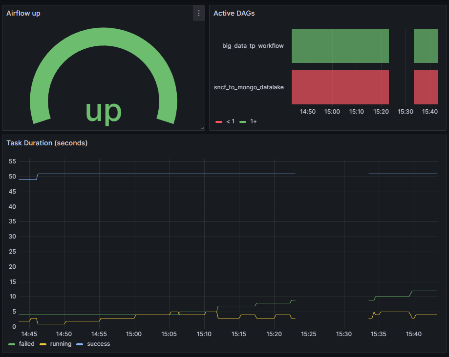
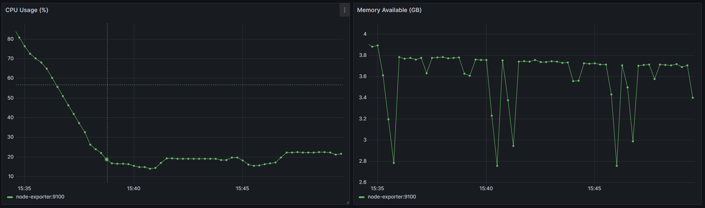
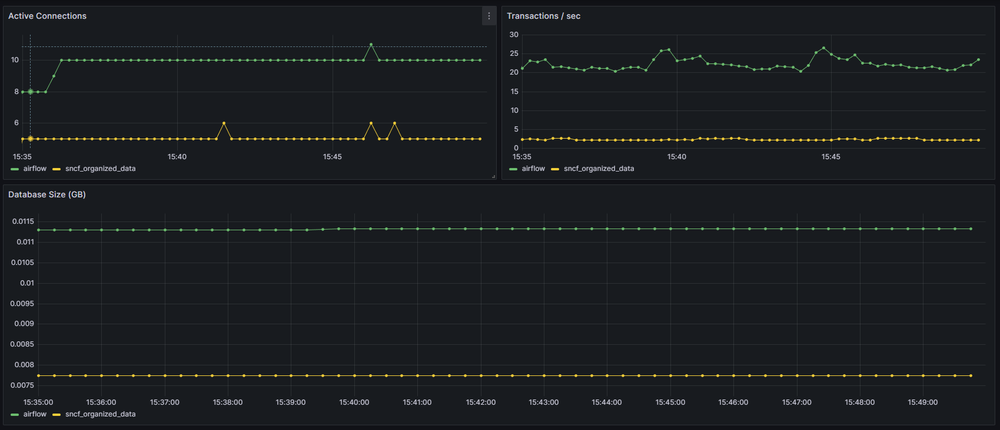
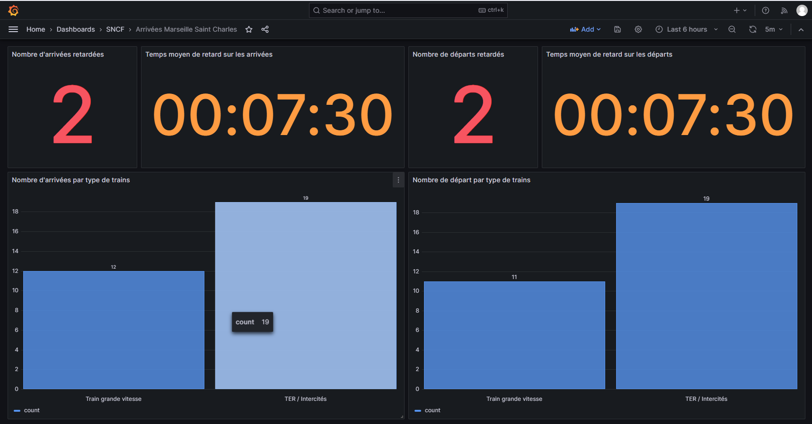

# Big-Data : Suivi des arrivées en gare de Marseille Saint-Charles

Ce projet a pour objectif de collecter, stocker et analyser les arrivées des trains à la gare de Marseille Saint-Charles depuis l’API SNCF. Il permet de centraliser les données d’arrivées, de les stocker dans un datalake puis une base PostgreSQL, et de visualiser des indicateurs clés via des tableaux de bord Grafana.

Grâce à ce projet, il est possible de suivre en temps réel et historiquement :
- les types de train arrivés en gare,
- le nombre de retard par arrivées et départs,
- le temps moyen des retards

##  Prérequis

Pour que ce projet fonctionne, vous devez posséder les éléments suivants sur votre machine
- [ ] L'outil de versionning *Git*
- [ ] L'outil de conteneurisation *Docker*, ainsi que *docker compose*
- [ ] Un token d'accès à l'API SNCF

> [!TIP]
> Vous pouvez demander votre token d'accès sur le site de l'[API SNCF](https://numerique.sncf.com/startup/api/token-developpeur/)

## Installation

Pour faire fonctionner ce projet, suivre ces étapes :
- [ ] Cloner le repository à l'aide de la commande `git clone https://github.com/Oceane4973/Big-Data.git`
- [ ] Dupliquer le fichier `.env-example` et renommer la copie en `.env`
- [ ] Renseigner les variables d'environnement nécessaires au fonctionnement du projet
    - `SNCF_API_TOKEN` : Le token récupéré auprès de *SNCF*
    - `MONGO_USER` : L'utilisateur de la base de données *Mongo*
    - `MONGO_PASSWORD` : Le mot de passe de l'utilisateur de la base de données *Mongo*
    - `AIRFLOW_ADMIN_USERNAME` : L'utilisateur administrateur *Airflow*
    - `AIRFLOW_ADMIN_PASSWORD` : Le mot de passe de l'utilisateur *Airflow*
    - `AIRFLOW_ADMIN_EMAIL` : L'email de l'administrateur *Airflow*
    - `AIRFLOW_POSTGRES_USER` : L'utilisateur de la base de données *Postrges* pour *Airflow*
    - `AIRFLOW_POSTGRES_PASSWORD` : Le mot de passe de l'utilisateur de la base de données *Postrges* pour *Airflow*
    - `POSTGRES_USER` : L'utilisateur de la base de données *Postrges*
    - `POSTGRES_PASSWORD` : Le mot de passe de l'utilisateur de la base de données *Postrges*
    - `GRAFANA_ADMIN_USER` : L'utilisateur *Grafana*
    - `GRAFANA_ADMIN_PASSWORD` : Le mot de passe de l'utilisateur *Grafana*
- [ ] Ouvrir un terminal à la racine du projet
- [ ] Démarrer les conteneurs avec la commande `docker compose up -d --build`
- [ ] Se rendre sur l'interface *Airflow*
    - Si vous n'avez pas modifié les variables d'environneemnt associées : http://localhost:8082
- [ ] Activer le DAG `big_data_tp_workflow`
- [ ] Visiter les tableaux de bord *Grafana*
    - Si vous n'avez pas modifié les variables d'environneemnt associées : http://localhost:3000

> [!NOTE]
> Les autres variables d'environnement du fichier `.env` sont complétées par défaut mais peuvent être modifiées si nécessaire.

> [!CAUTION]
> Le conteneur `airflow-webserver` peut être long à démarrer. Il est nécessaire d'attendre environ 5 minutes avant que le service ne soit complètement lancé.

## Architecture du projet

Ce projet est architecturé de la manière suivante :
```
+-----------------+       +------------------+       +-----------------+       +-----------------+
| API SNCF        |  -->  | Datalake (Mongo) |  -->  | Spark & Python  |  -->  | Postgres        |
| (/arrivals)     |       | JSON brut        |       | Traitement      |       | Nettoyé         |
+-----------------+       +------------------+       +-----------------+       +-----------------+
                |                                       |                               |
                v                                       v                               |
            +-----------------------------------------------+                           |
            | Airflow (webserver & scheduler)               |                           |
            | Automatisations API SCNF & Spark              |                           |
            +-----------------------------------------------+                           |
                                                                                        v
                                                                                +-----------------+
                                                                                | Grafana         |
                                                                                | Tableaux de bord|
                                                                                +-----------------+
```

**Composants :**
- `API SNCF` : Fournit les données en temps réel sur les arrivées en gare *Marseille Saint-Charles*.
- `Datalake` : Stocke les données brutes récupérées de l’API pour un historique complet (*Mongo DB*).
- `Spark & Pytohn` : Répartit la charge du traitement des données par le script *Python* à l'aide d'un master et d'un worker *Spark*. 
- `Postgres` : Base de données relationnelle contenant les données nettoyées et transformées.
- `Airflow` : Orchestration des tâches ETL (Extraction, Transformation, Chargement).
- `Grafana` : Visualisation et suivi des indicateurs clés.

En supplément de ces éléments, un service *Prometheus* surveille ces composants et récupère des informations de fonctionnement.

### Fonctionnement

Le fonctionnement du projet peut être synthétiser par ces étapes :
- *Extraction des données*
    - Les données sont récupérées depuis l’API SNCF via un script Python automatisé par *Airflow*.
    - Les informations brutes des arrivées en gare de *Marseille Saint-Charles* sont extraites.
    - Les données sont sauvegardées au format JSON dans le datalake *MongoDB* pour conserver un historique complet.
- *Transformation*
    - Un conteneur `spark-master` gère un conteneur `spark-worker`.
    - Ces conteneurs possèdent un script *Python* pour traiter et nettoyer les données
    - Un DAG *Airflow* automatise l'exécution du script à travers les conteneurs
- *Stockage des données nettoyées*
    - Les données transformées sont insérées dans une base PostgreSQL.
    - La base est structurée pour faciliter les analyses et requêtes rapides sur les arrivées en gare.
- *Visualisation dans Grafana*
    - *Grafana* se connecte à *PostgreSQL* pour créer des dashboards sur les arrivées en gare
    - *Grafana* se connecte à *Prometheus* pour afficher des dashboards sur les conteneurs.

## Structure du projet

Le projet est structuré de la manière suivante :
- `.github` : Contient les fichiers de configuration pour la CI *Github*
- `airflow/dags` : Contient les DAGs *Airflow* pour orchester ETL
- `archive_prespark_dsiruptions` : Contient les fichiers ETL pour le traitement des interruptions (détaillée dans la partie suivante)
- `monitoring` : Contient la configuration de *Prometheus*
- `scripts` : Contient les scripts pour les DAGs *Airflow*, ainsi que les scripts SQL utilisés
- `spark/jobs` : Contient les scripts *Python* utilisés pour les jobs *Spark*
- `.env-example` : Un fichier exemple pour la configuration de l'environnement
- `docker-compose.yml` : La configuration de nos conteneurs
- `README.md` : La documentation du projet

### Projet archive interruptions

Avant de s'orienter vers les arrivées prévues à la gare Marseille Saint-Charles, le projet s'était porté sur les interruptions de service.

Cependant, afin d'avoir des tableaux de bord plus complets et intéressants à traiter, le projet s'est recentré sur les arrivées.

Afin de ne pas perdre ce qui avait été fait, les éléments associés à cette première version ont été gardés dans le dossier `archive_prespark_disruptions` :
- `process_disruptions.py` : Le script *Python* permettant de traiter les données enregistrées dans le datalake
- `disruptions.sql` : Le script SQL pour la création de la base de données liée aux interruptions
- `disruptions_dag.py` : Le DAG *Airflow* pour exécuter automatiquement le script de traitement

### Kafka

Un service *Kafka* est présent dans le fichier `docker-compose.yml`.

Ce service n'est utile qu'en cas de traitement de 2 APIs distinctes. Dans ce projet, nous utilisons qu'une seule API, donc nous avons choisi de désactiver ce service.

## Tableaux de bord *Grafana*

Au sein de *Grafana*, deux connexions sont automatiquement créées au démarrage du conteneur :
- Une connexion vers la base de données *Postgres*
- Une connexion vers *Prometheus*

Des tableaux de bord sont également automatiquement créés. Nous allons maintenant les présenter.

### Monitoring

Le dossier *Monitoring* contient les tableaux de bord liés au monitoring du projet.

3 tableaux de bords sont disponibles :
- *Airflow & DAGs* : Pour visualiser le statut de *Airflow* et des DAGs



- *Node exporter - System* : Pour visualiser les informations liées au fonctionnement du système



- *PostgreSQL - Databases* : Pour visualiser les informations sur les bases de données *PostrgeSQL*



### SNCF

Le dossier SCNF contient un seul tableau de bord présentant les informations suivantes :
- Nombre d'arrivées en retard 
- Temps moyen du retard pour les arrivées
- Nombre de départs en retard
- Temps moyen du retard pour les arrivées
- Nombre d'arrivées par type de train
- Nombre de départs par type de train



---

#### Auteurs

Projet développé par **Océane MONGES**, **Evan VITALIS** et **Yannick CHAVANIS**